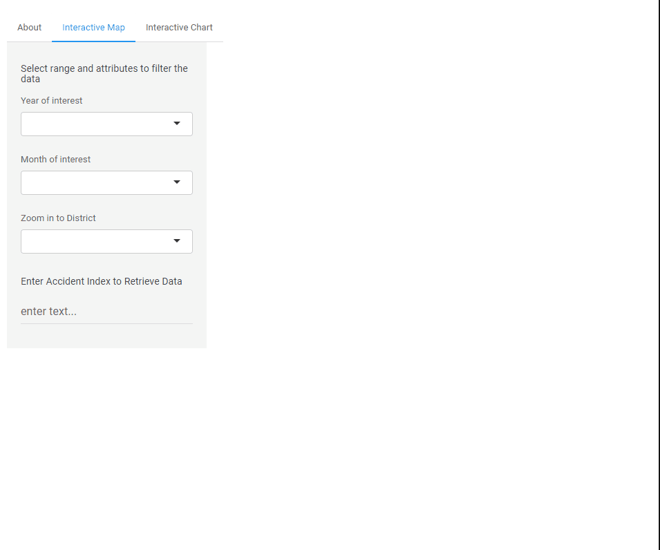
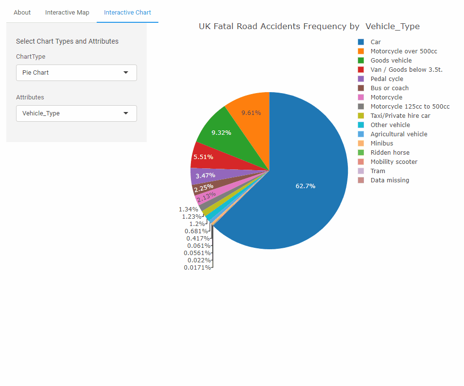

<style>
slides > slide.title-slide {
  background: #EEFBFF;
}


slides > slide.title-slide hgroup h1, 
slides > slide.title-slide hgroup h2 {
 color: #1c184e;
   margin-top: -15px;}

slides > slide.title-slide p {
  color: #4145C3;
}

slides > slide {
  background: #EEFBFF;
}


slides > slide > hgroup h2  {
  margin-top: +25px;
}

slides > slide  #dataslides {
  margin-top: -10px;
}

slides > slide #dataslides > p {
    color: #04087F;
}


</style>


## Introduction {.data #dataslides .smaller}
<hr style="border: 2px solid green;" />
<p><span style="font-size: 14pt;">In 2015, the UN rolled out the <strong>2030 Agenda for Sustainable Development</strong>.In Sustainable Development Goals 3.6, the UN is committed to halve the road accident fatalities and injuries world wide.&nbsp;</span></p>
<blockquote>
<p style="text-align: center;"><strong><span style="font-family: verdana, geneva; font-size: 28pt;">"SDG 3.6: By 2020, halve the number of global deaths and injuries from road traffic accidents."</span></strong></p>
</blockquote><br>
<p><span style="font-size: 14pt;"> This Shiny application is created in 2019, within one year before the proposed deadline. The 2005-2015 UK road Accident dataset is obtained from: https://www.kaggle.com/silicon99/dft-accident-data. This app offer the UK public a visualization tool on the fatal road accidents in UK and the infographics associated with them. &nbsp;</span></p></html>
<p><span style="font-size: 14pt;"> In the following slides, we will discuss on our <strong>Data Science Process</strong>, <strong>App Description</strong> and our <strong>Experience</strong>. &nbsp;</span></p>


## Data Science Process {#dataslides .smaller}
<hr style="border: 2px solid green;" />
<strong>Asking an interesting question:</strong><br>
In conjunction with UN Sustainable Development Goals 3.6, we want to know what is the historical trend and infographic associated with Fatal Road Accidents in UK. 

<strong>Get the Data:</strong><br>
The 2005-2015 UK road Accident dataset contained all road accidents reported. <br>
https://www.kaggle.com/silicon99/dft-accident-data.

<strong>Explore the Data:</strong><br>
head(), summary(), str(), and boxplot() are used to understand dataset, identify missing values, and gauge fittings of the data.


<strong>Model the Data:</strong><br>
Data is cleaned, integrated and transformed in order to work with shiny and visualization tools.

<strong>Communicate and Visualize the result:</strong><br>
Data visualization is available on github and shiny io, slides on rpubs. 


 
## App Description {#dataslides .smaller}
<hr style="border: 2px solid green;" />
Our Shiny app consists of two tabs. One for map visualization, and the other for chart visualization. Our final dataset is filtered to only show accidents involving fatalities.






## Experience {#dataslides .smaller}
<hr style="border: 2px solid green;" />
As with all new learning experience, we had our struggles with getting things to work. We learned the hard way that the code that worked on our local machine does not necessarily work on the cloud server. There are always little bit and pieces of details that can go wrong. 

Visualization is an important tool for all data scientist. We are glad that we have a new tool handy in our pocket now. 

Link to our app is as follow:<br>
- Shiny App: https://enjunz.shinyapps.io/uk_fatal_accidents_2005-2015_visualization/<br>
- Source Code: https://github.com/EnJunChoong/RoadToZeroFatality  
<br><br><br><br>
**Please initiate from rstudio to run Shiny from github if the free 25hrs perMonth capacity on shinyapps.io has been reach:

```{r echo=TRUE, eval=FALSE}
library('shiny')
runGitHub("RoadToZeroFatality", "EnJunChoong")
```


